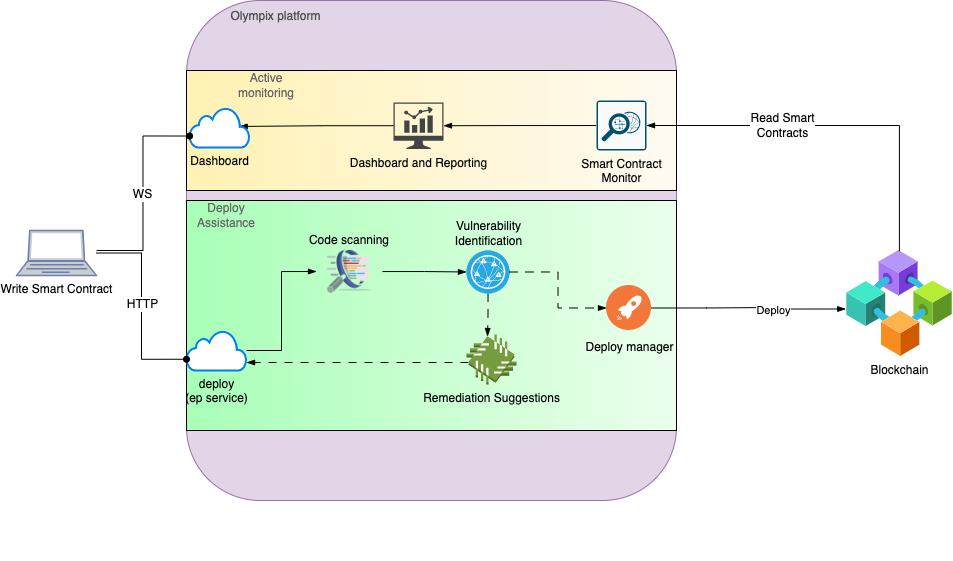

# Safe Contracts Platform
This platform provides a solution for contract parties that want to deploy their smart contracts is a secure way and be aware of their security health overtime.

## High level architecture
The following is a high level architecture diagram drawing key components.

There are two main phases:
- **Deploying Assistance**: Which helps through the process of deploying smart contracts.
- **Active Monitoring**: Which provides real-time monitoring of the smart contracts.

## Components
### From Deploy Assistance:
- **deploy end point**: A service endpoint to post the smart contracts. This is a web service that can be implemented with Node.js.
- **Code scanning**: This component scans the smart contracts looking for known vulneabilities. A source of truth can be the Common Weakness Enumeration (CWE) database, also the Ethereum Smart Contract Security Best Practices. This runs automatically as part of the pipeline.
- **Vulnerability Identification**: The system should identify any vulnerabilities that exist in the smart contract. This can be done using pattern matching or rule-based algorithms.
- **Remediation Suggestions**: Based on the vulnerabilities identified (or not) and its severity, the system should provide suggestions for remediation, such as code changes to eliminate the vulnerability or proceed to deploy the smart contract.
### From Active Monitoring:
- **Dashboard**: A Web Service that provides a Dashbord.
- **Dashboard and Reporting**: The system should provide a dashboard or reporting mechanism to give developers, stakeholders, and security teams visibility into the security of their smart contracts. The dashboard should display information such as the number of vulnerabilities, severity, and track other relevants.
- **Smart Contract Monitor**: The system should continuously monitor the smart contract for new vulnerabilities and provide updated remediation suggestions as necessary. This can be done by regularly scanning the smart contract code.
